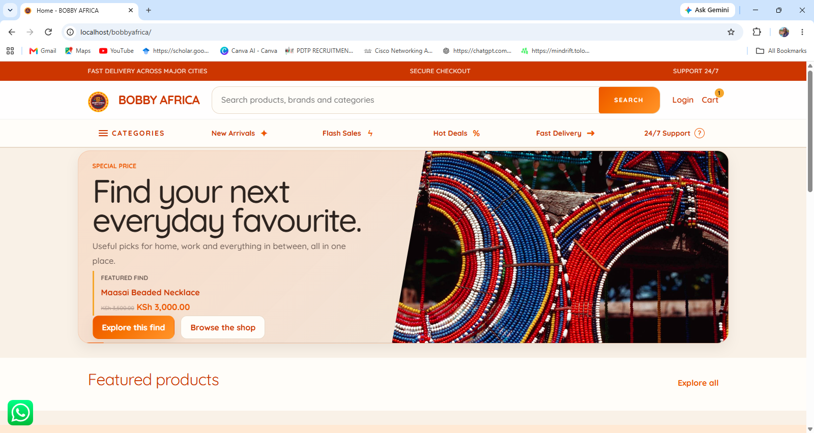

**Bobby Africa** is a modern African-focused e-commerce website built with **WordPress and WooCommerce**, created to showcase and sell African jewelry, clothing, ornaments, accessories, cultural products, and other African-inspired merchandise.

The platform combines the flexibility of WordPress CMS with the e-commerce capabilities of WooCommerce to provide a scalable online shopping experience for customers and an easy-to-manage platform for administrators.

---

## 🛍️ About Bobby Africa

Bobby Africa is an online marketplace dedicated to African fashion, craftsmanship, culture, and lifestyle products.

The store provides a digital platform where customers can discover and purchase products such as:

* 💍 African Jewelry
* 👗 African Clothing
* 👜 Bags & Accessories
* 🪘 Traditional Ornaments
* 🎨 African Art & Décor
* 👑 Cultural Accessories
* 🧿 Handmade Products
* 👟 African-inspired Footwear
* 🎁 African Gifts
* 🏺 Home & Lifestyle Products

The objective is to bring **African creativity, culture, craftsmanship, and fashion into a modern online shopping experience**.

---

# ⚙️ Platform

Bobby Africa is built using:

| Technology             | Purpose                       |
| ---------------------- | ----------------------------- |
| **WordPress**          | Content Management System     |
| **WooCommerce**        | E-commerce functionality      |
| **PHP**                | WordPress/theme customization |
| **MySQL**              | Database                      |
| **HTML5**              | Page structure                |
| **CSS3**               | Styling and responsive design |
| **JavaScript**         | Interactive functionality     |
| **WordPress REST API** | Data/API integrations         |
| **WooCommerce API**    | E-commerce integrations       |

Additional WordPress plugins may be used to extend functionality such as payments, shipping, SEO, security, analytics, and marketing.

---

# 🎨 Design & User Experience

Bobby Africa is designed around a modern African-inspired visual identity while maintaining familiar e-commerce patterns that make the store easy to navigate.

The design focuses on:

* African-inspired visual elements
* Modern typography
* High-quality product photography
* Clear product categorization
* Simple navigation
* Mobile-first responsiveness
* Fast product discovery
* Easy checkout
* Accessible interface
* Consistent branding

The storefront is intended to provide a balance between **African cultural identity and modern e-commerce design**.

---

# 🛒 WooCommerce Features

WooCommerce provides the core shopping functionality of Bobby Africa.

### Product Management

Administrators can manage:

* Product names
* Product descriptions
* Product images
* Product prices
* Sale prices
* Stock
* SKUs
* Categories
* Tags
* Attributes
* Variations
* Shipping information

---

## 📦 Product Categories

The store can organize products into categories such as:

```text
Bobby Africa
│
├── Jewelry
│   ├── Necklaces
│   ├── Bracelets
│   ├── Earrings
│   ├── Rings
│   └── Beaded Jewelry
│
├── Clothing
│   ├── Dresses
│   ├── Shirts
│   ├── Skirts
│   ├── African Print
│   └── Traditional Wear
│
├── Accessories
│   ├── Bags
│   ├── Belts
│   ├── Scarves
│   └── Headwear
│
├── Ornaments
│   ├── Traditional Ornaments
│   ├── Cultural Items
│   ├── Decorative Items
│   └── Handmade Items
│
└── Home & Lifestyle
    ├── Décor
    ├── Art
    ├── Cultural Pieces
    └── Gifts
```

Categories can be expanded as the Bobby Africa marketplace grows.

---

# 🏠 Storefront

The Bobby Africa storefront can include:

* Header navigation
* Logo and branding
* Product search
* Account navigation
* Shopping cart
* Promotional banners
* Featured products
* Product categories
* Flash sales
* New arrivals
* Best-selling products
* Recommended products
* Promotional sections
* Newsletter subscription
* Footer navigation

---

# 🔎 Product Discovery

Customers can discover products through:

### Search

WooCommerce product search allows customers to search for products by keywords.

### Categories

Products can be organized into clearly defined categories.

### Product Tags

Tags can be used to improve product discovery and filtering.

### Product Attributes

Attributes can be used for properties such as:

* Size
* Color
* Material
* Pattern
* Style
* Design

### Product Filters

The store can provide filtering functionality based on attributes such as price, category, size, color, and availability.

---

# 🛒 Shopping Cart

Customers can:

* Add products to their cart
* Increase or decrease quantities
* Remove products
* View cart totals
* Apply coupons
* Review shipping costs
* Proceed to checkout

The cart is powered by WooCommerce.

---

# 💳 Checkout

The Bobby Africa checkout process is powered by WooCommerce and can integrate with supported payment gateways.

The checkout process may include:

```text
Shopping Cart
      ↓
Checkout
      ↓
Customer Information
      ↓
Shipping Information
      ↓
Payment Method
      ↓
Order Confirmation
```

Payment gateways can be added according to the target market and business requirements.

---

# 📦 Orders

WooCommerce provides order management functionality for administrators.

Administrators can manage:

* New orders
* Processing orders
* Completed orders
* Cancelled orders
* Refunded orders
* Customer information
* Shipping information
* Order items
* Payment information
* Order notes

Customers can also access their order history through their WooCommerce account.

---

# 👤 Customer Accounts

Registered customers can manage their:

* Profile
* Password
* Billing address
* Shipping address
* Orders
* Downloads, where applicable
* Account details

The WooCommerce **My Account** functionality provides the foundation for customer account management.

---

# ❤️ Wishlist

A wishlist system can allow customers to save products for later.

Depending on the implementation, wishlist functionality can be provided through a dedicated WooCommerce-compatible plugin or custom development.

---

# 📱 Responsive Design

Bobby Africa is designed to work across:

* 🖥️ Desktop
* 💻 Laptop
* 📱 Mobile
* 📲 Tablet

The storefront should adapt its layout, navigation, product grids, images, and checkout experience according to the user's screen size.

---

# 🎯 WordPress Architecture

The Bobby Africa website is structured around the WordPress ecosystem.

```text
WordPress
│
├── Theme
│   └── Jovixel's Mart Theme
│
├── WooCommerce
│   ├── Products
│   ├── Categories
│   ├── Cart
│   ├── Checkout
│   ├── Orders
│   └── Customer Accounts
│
├── Plugins
│   ├── Payment
│   ├── Shipping
│   ├── SEO
│   ├── Security
│   └── Other Extensions
│
├── Media Library
│   └── Product Images
│
└── WordPress Database
```

---

# 👨‍💻 Theme Development

Where possible, Bobby Africa customizations should be implemented through a **WordPress child theme** rather than directly modifying the parent theme.

This helps preserve customizations when the parent theme receives updates.

A typical child-theme structure may look like:

```text
jovixels-mart-child/
│
├── style.css
├── functions.php
│
├── assets/
│   ├── css/
│   ├── js/
│   └── images/
│
├── inc/
│   └── custom-functions.php
│
├── template-parts/
│
├── woocommerce/
│   ├── archive-product.php
│   ├── single-product.php
│   ├── cart/
│   ├── checkout/
│   └── myaccount/
│
└── screenshot.png
```

WooCommerce templates can be overridden within the child theme when customization beyond standard WooCommerce settings is required.

---

# 🧩 WooCommerce Template Customization

Bobby Africa can customize WooCommerce templates through the child theme.

For example:

```text
woocommerce/
├── archive-product.php
├── content-product.php
├── single-product.php
├── cart/
├── checkout/
└── myaccount/
```

This makes it possible to create a highly customized storefront while retaining WooCommerce's underlying functionality.

Customizations should follow WooCommerce's recommended template override practices and be reviewed when WooCommerce is updated.

---

# 🔌 WordPress Plugins

Bobby Africa can use WordPress plugins to extend the functionality of the store.

Possible plugin categories include:

* Payment gateways
* Shipping
* SEO
* Security
* Product filtering
* Wishlist
* Reviews
* Analytics
* Email marketing
* Performance optimization
* Image optimization
* Backup
* Social media integration

Plugins should be selected carefully to avoid unnecessary performance overhead and conflicts.

---

# 🔐 Security

Security is an important part of the Bobby Africa platform.

Recommended practices include:

* Keep WordPress updated
* Keep WooCommerce updated
* Keep plugins updated
* Use strong administrator passwords
* Use HTTPS
* Limit administrator accounts
* Use trusted plugins
* Perform regular backups
* Protect the WordPress login
* Monitor suspicious activity
* Remove unused plugins and themes
* Keep PHP updated

Payment information should be processed through appropriate payment providers and should not be unnecessarily stored within the WordPress installation.

---

# 🚀 Installation

## Requirements

Before installing Bobby Africa, ensure the hosting environment supports:

* WordPress
* WooCommerce
* PHP
* MySQL or MariaDB
* HTTPS/SSL
* A compatible web server

---

## WordPress Installation

Install WordPress on the hosting environment and configure:

1. Site title
2. Site URL
3. Administrator account
4. Database
5. Permalinks
6. Time zone
7. Media settings

---

## WooCommerce Installation

Install and activate WooCommerce from the WordPress administration dashboard.

Configure:

* Store location
* Currency
* Product settings
* Tax settings
* Shipping
* Payments
* Emails
* Accounts and privacy

---

# 🎨 Bobby Africa Theme

Install the Bobby Africa theme or child theme through:

```text
WordPress Dashboard
        ↓
Appearance
        ↓
Themes
        ↓
Add New Theme
        ↓
Upload Theme
```

Upload the theme ZIP file and activate it.

If Bobby Africa is implemented as a child theme, ensure the required parent theme is installed before activating the child theme.

---

# 🖼️ Screenshots

Store screenshots inside:

```text
screenshots/
├── dashboard.png
├── homepage.png
├── shop.png
├── product-page.png
├── cart.png
├── checkout.png
└── mobile.png
```

The main dashboard screenshot is displayed at the beginning of this README.

Additional screenshots can be added below:

### Homepage


### Shop


### Product Page


### Cart


### Checkout


---

# 🛠️ Development Workflow

For development, changes should preferably be tested on a staging or local WordPress environment before being deployed to production.

Recommended workflow:

```text
Local Development
       ↓
Testing
       ↓
Staging
       ↓
Quality Assurance
       ↓
Production
```

Theme and custom code should be version-controlled using Git where practical.

---

# 📁 Project Structure

A typical Bobby Africa WordPress project may contain:

```text
Bobby-Africa/
│
├── wp-content/
│   │
│   ├── themes/
│   │   └── bobby-africa-child/
│   │       ├── style.css
│   │       ├── functions.php
│   │       ├── assets/
│   │       ├── inc/
│   │       ├── template-parts/
│   │       └── woocommerce/
│   │
│   └── plugins/
│
├── screenshots/
│   ├── dashboard.png
│   ├── homepage.png
│   ├── shop.png
│   ├── product-page.png
│   └── checkout.png
│
└── README.md
```

---

# 🌍 Future Development

Potential future improvements for Bobby Africa include:

* 🌍 International shipping
* 💱 Multi-currency support
* 🌐 Multi-language support
* 💳 Additional African payment gateways
* 📦 Advanced order tracking
* 🏪 Multi-vendor marketplace functionality
* 📊 Advanced sales analytics
* 🤖 AI-powered product recommendations
* 🔍 Advanced product filtering
* ⭐ Customer reviews and ratings
* ❤️ Advanced wishlist functionality
* 🎟️ Discount and promotional campaigns
* 📱 Progressive Web App functionality
* 📲 Dedicated mobile application
* 💬 Customer support/live chat
* 📍 Location-based delivery
* 🚚 Delivery partner integrations

---

# 🤝 Contributing

Contributions and improvements are welcome.

When working on the project:

1. Create a separate development branch.
2. Make and test your changes.
3. Avoid modifying WordPress core files.
4. Avoid modifying WooCommerce plugin core files.
5. Use the child theme for theme customizations.
6. Document significant changes.
7. Test WooCommerce functionality after template changes.
8. Submit changes for review before deployment.

---

# 📄 License

Bobby Africa is a proprietary e-commerce project unless otherwise specified.

The Bobby Africa brand, logo, product content, visual assets, custom designs, and proprietary code may not be reproduced, redistributed, or commercially reused without appropriate authorization.

---

# 🌍 Bobby Africa

**African Culture. African Craftsmanship. African Style.**

Bobby Africa brings African fashion, jewelry, ornaments, accessories, and lifestyle products together through a modern **WordPress + WooCommerce** shopping experience.

**Built with WordPress. Powered by WooCommerce. Inspired by Africa.**

---

## 📌 Project Status

**Project:** Bobby Africa

**Platform:** WordPress

**E-Commerce:** WooCommerce

**Project Type:** African Fashion & Lifestyle E-Commerce

**Status:** 🚧 Active Development
